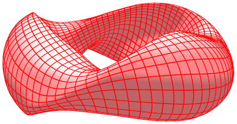

# booz_xform

`booz_xform` is a package for computing Boozer coordinates in toroidal
magnetohydrodynamic equilibria, including both stellarators and
tokamaks.  The package described here follows the same algorithm as
the fortran 77 code of the same name in
[Stellopt](https://github.com/PrincetonUniversity/STELLOPT/tree/develop/BOOZ_XFORM).
However the package here is written in C++, with python bindings.  The
package here is also written so as to allow input from equilibrium
codes other than VMEC, it is parallelized using OpenMP, and it
includes functions for plotting output.  It is also equipped with unit
and regression tests and continuous integration.

`booz_xform` requires NetCDF, a C++ compiler, and python3. For many
users, the code can be installed by executing

    pip install booz_xform

For more installation options and other information, see the
[booz_xform documentation
here.](https://hiddensymmetries.github.io/booz_xform/)